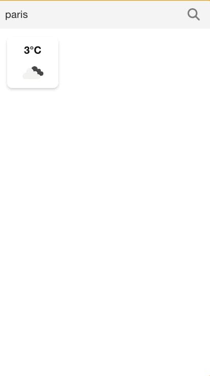

<div align="right"><i>By Quentin Rouvier, Philippe Cheype - Epitech Nice - 2023</i></div></br></br></br>
<div align="center">
<h1>Workshop Front</br>Building a good looking weather app</h1>
<a href="https://indigen.com/"></a>
</div>

</br></br>

## Before starting

If you want to be present you need send an email to philippe1.cheype@epitech.eu with the following object:
```
[WORKSHOP-FRONT] Nom Prénom
```
__/!\ Put your real firstname and lastname__

And in the mail share a .zip or .tar.gz file with the contents of your repository.\
__/!\ Remove the folder `node_modules/` before compressing and sending please__


Any work you do needs to be in the request, if you don't do this or didn't advance into the project at all you will be marked absent.

<br/><br/>

## Introduction

In this exercice we will be using the following technologies:
- [Vue.js](https://vuejs.org/) -> JavaScript [framework](https://www.wikiwand.com/en/Software%20framework) to make our lives easier by implementing very useful features and patterns.
- [Quasar](https://quasar.dev/) -> A front-end framework that has a lot of [components](https://developer.mozilla.org/en-US/docs/Web/Web_Components) already implemented and ready to use.
- [Sass](https://sass-lang.com/) -> a CSS preprocessor that allows us to write CSS with more features and more readable stylesheets.

We will be using the [openweathermap.org](https://openweathermap.org/) API. It's freely available (or at least for our needs).
We will get weather information and display it in a nice way using the tools previously mentioned.

</br></br>

## Getting started

### Get API access

1. Go to [openweathermap.org/price](https://openweathermap.org/price) and create an account.
2. When signed-in click on your name at the top right and click on `My API keys`
3. You will find a `Key`, keep this tab open we will need that key later.
4. You can find the API documentation that we will use [here](https://openweathermap.org/current).
    * Here is the exact request we will use, but feel free to explore the API: `https://api.openweathermap.org/data/2.5/weather?q={city name}&units=metric&appid={API key}`
    * You need to replace values in brackets `{}` with the corresponding data


### Prerequisites

- [Node.js](https://nodejs.org/en/) -> JavaScript [runtime environment](https://www.wikiwand.com/en/Runtime_system) that allows us to run JavaScript code outside of a browser.
  + Do `node -v` to check if it's installed.


### Setup front stack

1. Install project with Vite CLI
    * Select `Vue` as the framework
    * Select `JavaScript` as the variant
    ```bash
    npm init vite@latest weather-app
    cd weather-app
    ```
2. Install `Quasar` and `Sass` dependencies
    ```bash
    npm install quasar @quasar/extras
    npm install -D @quasar/vite-plugin sass@1.32.0
    ```
3. Go to `weather-app/src/main.js` and paste the following:
    ```js
    import { createApp } from 'vue'

    import { Quasar } from 'quasar'
    import quasarIconSet from 'quasar/icon-set/svg-fontawesome-v6'
    import '@quasar/extras/material-icons/material-icons.css'
    import '@quasar/extras/fontawesome-v6/fontawesome-v6.css'
    import 'quasar/src/css/index.sass'

    import App from './App.vue'

    const app = createApp(App)

    app.use(Quasar, {
      plugins: {},
      iconSet: quasarIconSet,
    })
    app.mount('#app')
    ```
4. Go to `weather-app/vite.config.js` and paste the following:
    ```js
    import { defineConfig } from 'vite'
    import vue from '@vitejs/plugin-vue'
    import { quasar, transformAssetUrls } from '@quasar/vite-plugin'

    export default defineConfig({
      plugins: [
        vue({
          template: { transformAssetUrls }
        }),
        quasar({
          sassVariables: 'src/styles/quasar-variables.sass'
        }),
      ],
    })
    ```
5. Create a new folder named `styles` in `weather-app/src/` and create a new file named `quasar-variables.sass` in it:
    ```scss
    $primary   : #1976D2
    $secondary : #26A69A
    $accent    : #9C27B0

    $dark      : #1D1D1D

    $positive  : #21BA45
    $negative  : #C10015
    $info      : #31CCEC
    $warning   : #F2C037
    ```

6. Run the project to check if everything is okay.
    ```bash
    npm run dev
    ```

After building and [transpiling](https://www.wikiwand.com/en/Source-to-source_compiler), vite will host the project on a local server. You can access it by going to [localhost:5173](http://localhost:5173) in your browser.


<br/><br/>

## Getting to know the architecture

You just got bombarded with files and folders, don't worry, we will go trough them one by one.

### The `weather-app` folder
```c
├── public/           // This folder just defines the index.html file and some related elements.
├── src/              // [see below]
├── .gitignore        // It defines files which you don't wan't to push.
├── package-lock.json // Defines some information about package versions. You don't need to worry about it.
├── package.json      // Defined the project. We can find useful information and packages here.
└── vite.config.js    // Defines the configuration of Vite. You can customize it here.
```

### The `src` folder
```c
├── assets/          // Images and any other assets are defined here
├── components/      // All the components of the project are defined here, components are the building blocks of an app.
├── App.vue          // This is the main file of the project.
├── main.js          // This is the entry point of the project. It defines the Vue.js instance and links modules.
└── style.css        // Stylesheets are defined here. We will be using Sass. You can also find default quasar styles.
```

</br></br>

## Let's get to work

Delete `components/HelloWorld.vue` and paste the following in `App.vue` :
```html
<template>
  <q-layout view="lHh Lpr lFf">

    <!-- Documentation q-input: https://quasar.dev/vue-components/input -->
    <q-input
      class="text-h6"
      filled
      outlined
      v-model="city"
      placeholder="Ville (ex: Paris)"
      @keydown.enter.prevent="callApi"
    >
        <template v-slot:append>
          <!-- Documentation q-btn: https://quasar.dev/vue-components/button -->
          <q-btn round flat icon="fas fa-magnifying-glass" @click="callApi"
          />
        </template>
      </q-input>
  </q-layout>
</template>

<script>
export default {
  name: 'App',

  data() {
    return {
      data: {},
      apiKey: '64d396add46be7a89c3e5a2fdd1ace91',
      corsProxy: 'https://cors-anywhere.herokuapp.com/',
    }
  },

  methods: {
    async callApi(newCity) {
      if (newCity !== '') {
        const request = `${this.corsProxy}api.openweathermap.org/data/2.5/weather?q=${this.city}&units=metric&appid=${this.apiKey}`;
        const options = {
          method: 'GET',
          headers: {
            'Content-Type': 'application/json',
          }
        };

        this.data = await fetch(request, options)
          .then((res) => res.json())
          .then((data) => data)
          .catch((err) => {
              console.log(err);
          });
        console.log(this.data);
      }
    }
  }
}
</script>
```

This is the base code on which you will work, launch it with vite `npm run dev` and put the name of a city in the search bar. You should see the weather data of the city you entered.

</br></br>

## Let's make it look good

Quasar components always start with `q-` they are just html blocks that have been pre-coded with all the essential customisations.

Start by building your `<template>` if you want to insert a variable for example data.something inside the `<template>` you can use `<div>{{ data.something }}</div>`.

Now add some `<styles>`, we are doing styles with Sass, the main differences is that you don't need to add `;` and `{}`. You can also indent your styles. Instead of doing :
```css
div {
  background-color: red;
  height: 200px;
}
```
You would do:
```scss
div
  background-color: red
  height: 200px
```

### First component

To teach you about componets we will do a first one together. They will enable you to re-use code and make your code more readable.

Let's create a `myStat.vue` file in the `src/components/` folder (This component will show a numerical value and an icon):
```html
<template>
  <div class="my-temp q-ma-md column justify-end items-center bg-white">
    <div class="my-temp__value">
      {{ value }}°C
    </div>
    <div class="my-temp__icon">
      
    </div>
  </div>
</template>

<script>
export default {
  name: 'MyTemperature',

  props: {
    value: {
      type: Number,
      default: 0,
    },
    weather: {
      type: Object,
      default: {},
    }
  }
}
</script>

<style scoped lang="sass">
.my-temp
  width: 100px
  height: 100px
  border-radius: 10px
  box-shadow: 0 3px 5px rgba(0, 0, 0, 0.2)

  &__value
    font-size: 1.25rem
    font-weight: 700

  &__icon
    height: 60px
    img
      height: 100%
</style>
```

Go back to `App.vue`, we first need to link our component to our App in the `<script>` tag:
```js
import myTemperature from './components/myTemperature.vue'; // Import it
export default {
  name: 'App',

  components: { // Define it
    myTemperature,
  },

  //...
}
```

Now we can use it in our `<template>`:
```html
<q-input><!-- ... --></q-input>
<my-temperature
  v-if="data"
  :value="Math.round(data.main.temp)"
  :weather="data.weather[0]">
/>
```

You should get something like this:\


Keep going, your objective now is to make it look good, you are free to use anything you want to achieve this goal.

Here are some ideas:
- Add color
- Add icons
- Make it responsive!
- Adding a button to get the weather of the user's current location.
- Adding a button to get the weather of a random city.
- Adding a loading animation while the API call is being made. (Take a look at the q-btn and/or q-spinner documentation)
- Implementing a custom background image by city name using the [Unsplash API](https://unsplash.com/developers) to get a random image of the city we are looking for.
- Switch between °C, °F and K.
- ...
