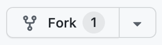
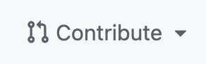
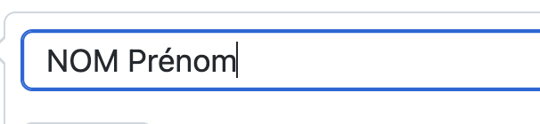
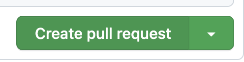
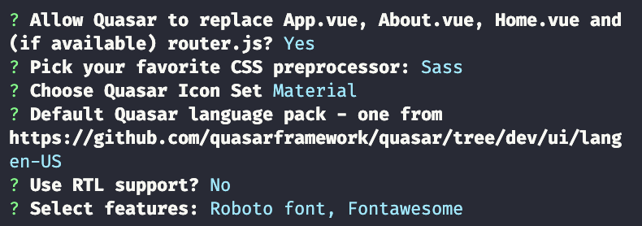

<div align="right"><i>By Quentin Rouvier, Philippe Cheype - Epitech Nice - 2023</i></div></br></br></br>
<div align="center">
<h1>Workshop Front</br>Building a good looking weather app</h1>
<a href="https://indigen.com/"></a>
</div></br></br>


## Before starting

<div style="color: red; font-size: 1.2em">
If you want to be present you need to fork this repository:  At the end of the hour you need to create a pull request by pressing this button on your github fork: , and open the pull request .

Now put your real firstname and lastname in the title of the pull request  and finally create it 

Any work you do needs to be in the request, if you don't do this or didn't advance into the project at all you will be marked absent.
</div>


## Introduction

In this exercice we will be using the following technologies:
- [Vue.js](https://vuejs.org/) -> JavaScript <u>[framework](https://www.wikiwand.com/en/Software%20framework)</u> to make our lives easier by implementing very useful features and patterns.
- [Quasar](https://quasar.dev/) -> A front-end framework that has a lot of <u>[components](https://developer.mozilla.org/en-US/docs/Web/Web_Components)</u> already implemented and ready to use.
- [Sass](https://sass-lang.com/) -> a CSS preprocessor that allows us to write CSS with more features and more readable stylesheets.
- [Axios](https://github.com/axios/axios) -> HTTP client for the browser and node.js that allows us to make HTTP requests.

We will be using the [openweathermap.org](https://openweathermap.org/) API. It's freely available (or at least for our needs).
We will get weather information and display it in a nice way using the tools previously mentioned.

_/!\ This workshop doesn't require extensive knowledge, though it would be easier if you are already familiar with Javascript. We are going to go trough every step with you, if at any time you don't understand something don't hesitate to ask for help._


## Getting started

### Prerequisites

- [Node.js](https://nodejs.org/en/) -> JavaScript <u>[runtime environment](https://www.wikiwand.com/en/Runtime_system)</u> that allows us to run JavaScript code outside of a browser.
  + Do `node -v` to check if it's installed.
- [yarn](https://yarnpkg.com/) -> <u>[Package manager](https://www.wikiwand.com/en/Package_manager)</u> that allows us to install and manage dependencies. (You can use npm instead)
  + Do `yarn -v` to check if it's installed.
- [Vue CLI](https://cli.vuejs.org/) -> Command line interface that allows us to create and manage Vue.js projects.
  + Do `vue --version` to check if it's installed.

### Installation

1. Clone this repository
2. Open a terminal in the project folder
3. Install project with `vue` (Vue-CLI)
    * Select `Default ([Vue 3] babel, eslint)`
```bash
vue create weather-app
cd weather-app
```
1. Install `Quasar` and `Sass` dependencies
    * Here are the options I chose:</br>
    * Both `material icon` and `fontawesome` are very good icon libraries.
```bash
vue add quasar
```
1. Add `Axios`
    * If you get this error: `error  'options' is defined but never used` go to [axios.js](weather-app/src/plugins/axios.js) to line 43 and add `options;` on the first line of the function.
```bash
vue add axios
```
1. Run the project
```bash
yarn serve
```

After building and <u>[transpiling](https://www.wikiwand.com/en/Source-to-source_compiler)</u>, yarn will host the project on a local server. You can access it by going to [http://localhost:8080](http://localhost:8080) in your browser.

_/!\ If your app is running on 8081, you already have something running on 8080, just use the highest one._


## Getting to know the architecture

You just got bombarded with files and folders, don't worry, we will go trough them one by one.

### The `weather-app` folder
```c
├── public           // This folder just defines the index.html file and some related elements.
├── src              // [see below]
├── .gitignore       // It defines files which you don't wan't to push.
├── babel.config.js  // Babel is the transpiler in question that translates Vue.js to JavaScript. You can configure it here.
├── jsconfig.json    // Defines configuration for javascript. This is not too known but you can customize your JS.
├── package.json     // Defined the project. We can find useful information and packages here.
├── vue.config.js    // Defines configuration for Vue.js. You can customize your Vue.js here.
└── yarn.lock        // Defines some information about package versions. You don't need to worry about it.
```

### The `src` folder
```c
├── assets           // Images and any other assets are defined here
├── components       // All the components of the project are defined here, components are the building blocks of an app.
├── styles           // Stylesheets are defined here. We will be using Sass. You can also find default quasar styles.
├── App.vue          // This is the main file of the project.
├── main.js          // This is the entry point of the project. It defines the Vue.js instance and links modules.
└── quasar-user-options.js  // Defines the options for Quasar. You can customize it here.
```

As you can see this is pretty close to a basic JS/CSS/HTML project with extra steps.

Take a look at [App.vue](weather-app/src/App.vue) and [HelloWorld.vue](weather-app/src/components/HelloWorld.vue) and try to play around with the vue syntax, get to know it.

_/!\ You are currently in hot reload mode because `yarn serve` is running, this means each save you make to your files will be applied to `localhost:8080`_


## Let's get to work

When you are comfortable with the syntax, delete `HelloWorld.vue` and delete the contents of `App.vue` and write only the necessary code:

```html
<template>
  <q-layout view="lHh Lpr lFf">
    <!-- ... -->
  </q-layout>
</template>

<script>
export default {
  name: 'App',
  // ...
}
</script>
```
